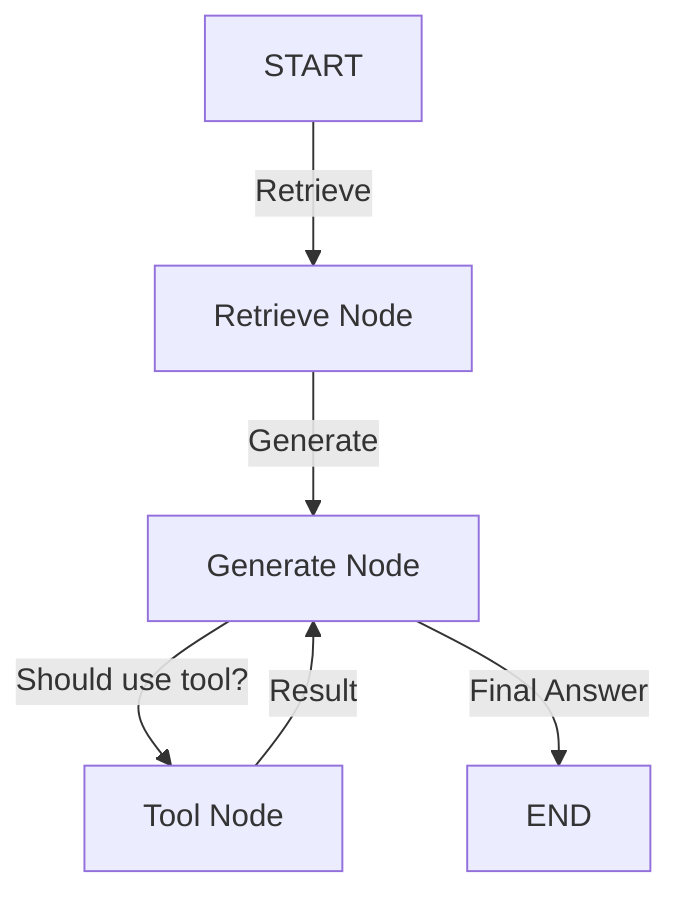

# Multi-Agent & Tool-Calling Expansion Roadmap

To support a dynamic toolkit and configurable agents, the architecture will evolve from a fixed 2-node graph to a **Tool-Aware State Machine**.

---

## 1. Tool Kit Definition (`app/engine/tools/`)

You would define a central repository of tools. Each tool is a Python function with a clear docstring (which the LLM uses to understand when to call it).

```python
# example: app/engine/tools/reporting.py
def generate_pdf_report(session_id: str, summary: str):
    """Generates a formal PDF report of the current conversation."""
    # Logic to create PDF...
    return "Report generated: /downloads/report_123.pdf"

def export_to_csv(data_json: str):
    """Exports retrieved data to a CSV file."""
    # Logic to create CSV...
    return "Data exported to CSV."
```

---

## 2. Updated Agent Configuration (SQLite)

We update `agent_definitions` in `relations_db.py` to store which tools are enabled for each agent.

```sql
ALTER TABLE agent_definitions ADD COLUMN enabled_tools TEXT DEFAULT '[]';
```

When a user "Configures a New Agent", they can check boxes for "PDF Reporting" or "CSV Export". This list is saved as a JSON array in `enabled_tools`.

---

## 3. Tool-Aware LangGraph (`graph_runner.py`)

The graph is expanded to include a `ToolNode` and a decision point (Conditional Edge).



### Key Changes:
1.  **Binding Tools**: Before calling the LLM, we filter the Toolkit by the agent's `enabled_tools` and "bind" them to the LLM.
    ```python
    tools = [generate_pdf_report, export_to_csv] # Filtered by registry
    llm_with_tools = llm.bind_tools(tools)
    ```
2.  **Conditional Routing**:
    - If the LLM returns a `tool_call`, the graph routes to the **Tool Node**.
    - If the LLM returns text, the graph routes to **END**.

---

## 4. UI Implementation

- **Agent Configuration Modal**: A new section with "Available Tools" checkboxes.
- **Chat UI**: When an agent uses a tool (e.g., "Generate PDF"), the `AgentChat.tsx` component receives a special "tool output" message and can display a "Download PDF" button directly in the chat bubble.

---

## Summary of the "Tool-Use" Flow
1. **User**: "Generate a PDF report of those findings."
2. **LLM**: Sees the `generate_pdf_report` tool in its toolkit. Returns a `tool_call` instead of an answer.
3. **LangGraph**: Routes to the `ToolNode`. Execution of `generate_pdf_report` happens on the server.
4. **LangGraph**: Passes the "Success" message back to the LLM.
5. **LLM**: "I have successfully generated your report. You can download it here."
